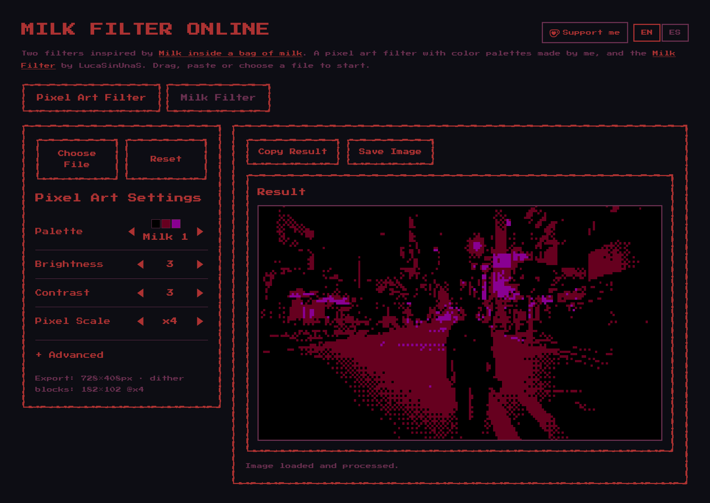
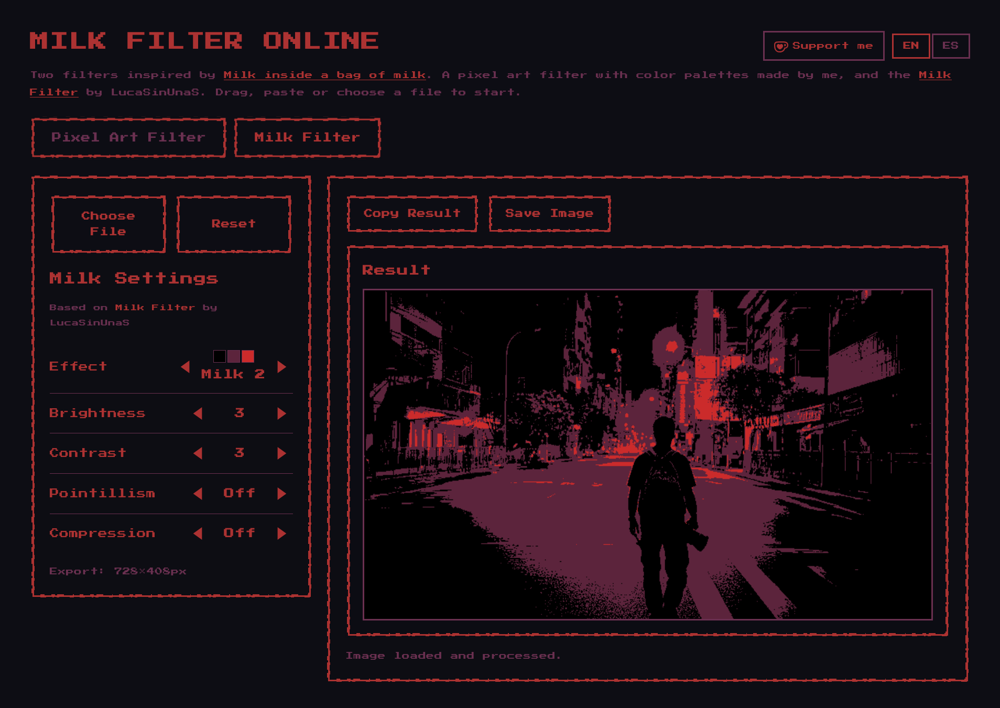
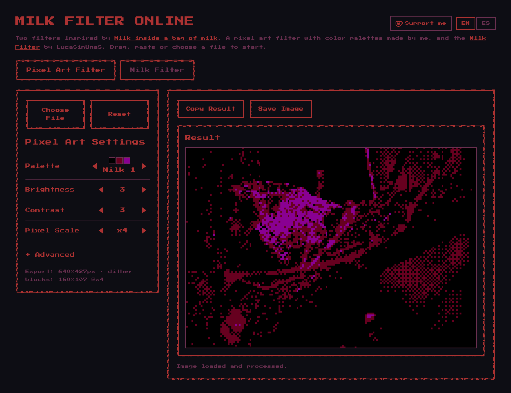
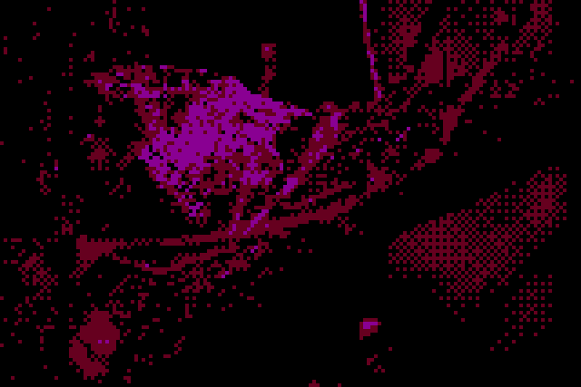
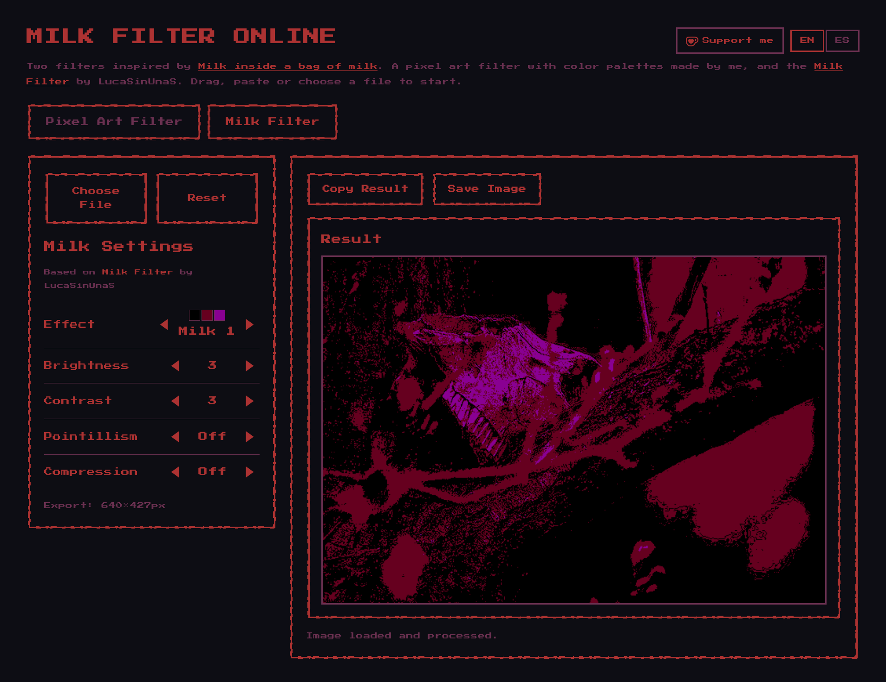
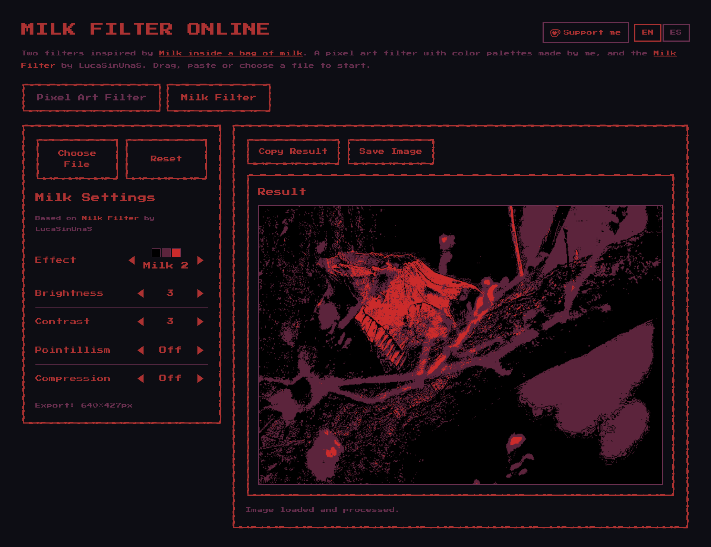

[![Contributors][contributors-shield]][contributors-url]
[![Forks][forks-shield]][forks-url]
[![Stargazers][stars-shield]][stars-url]
[![Issues][issues-shield]][issues-url]
[![MIT License][license-shield]][license-url]
[![Pageviews][pageviews-shield]][stats-url]
[![Images Exported][exported-shield]][stats-url]

 

  

  <h3 align="center">Milk Filter Online</h3>

  

    A browser-based image and video filter tool inspired by the visual style of <em>Milk inside a bag of milk</em>. 
    No install, no upload — everything runs locally in your browser.
     
     
    <a href="https://figurophobia.github.io/Milk-Filter-Online/"><strong>Try it live »</strong></a>
     
     
    <a href="https://github.com/figurophobia/Milk-Filter-Online/issues/new?labels=bug">Report Bug</a>
    &middot;
    <a href="https://github.com/figurophobia/Milk-Filter-Online/issues/new?labels=enhancement">Request Feature</a>
  

  
Table of Contents

  <ol>
    <li>
      <a href="#about-the-project">About The Project</a>
      <ul>
        <li><a href="#built-with">Built With</a></li>
      </ul>
    </li>
    <li><a href="#usage">Usage</a></li>
    <li><a href="#filters">Filters</a></li>
    <li><a href="#stats">Stats</a></li>
    <li><a href="#inspiration">Inspiration</a></li>
    <li><a href="#roadmap">Roadmap</a></li>
    <li><a href="#contributing">Contributing</a></li>
    <li><a href="#license">License</a></li>
    <li><a href="#credits">Credits</a></li>
  </ol>

---

## About The Project

  <table>
    <tr>
      <td align="center">
         
        <b>Pixel Art Filter</b> — dithering with Milk 1 palette at ×4 pixel scale
      </td>
      <td align="center">
         
        <b>Milk Filter</b> — Milk 2 palette, flat tones and deep reds
      </td>
    </tr>
  </table>

 

Milk Filter Online converts any image or video into the distinctive visual aesthetic of Nikita Kryukov's *Milk* game series — deep reds and purples, coarse dithering, flat palette quantization, and the oppressive dark atmosphere of the game's world.

It runs entirely in the browser. No server, no upload, no install.

> *"I'd like to buy a bag of milk."*

Key highlights:
* Two independent filters: **Pixel Art** (original dithering) and **Milk** (ported from LucaSinUnaS)
* Works on both **images and video**
* Drag & drop, paste, or file picker
* Adjustable parameters per filter with live preview
* Copy result to clipboard or save as PNG
* EN / ES interface
* Pixel-perfect UI built from the game's own visual language

(<a href="#readme-top">back to top</a>)

### Built With

* [![JavaScript][JavaScript-shield]][JavaScript-url]
* [![HTML][HTML-shield]][HTML-url]
* [![CSS][CSS-shield]][CSS-url]
* [![Python][Python-shield]][Python-url]

(<a href="#readme-top">back to top</a>)

---

## Usage

No installation needed. Just open the app and drop your file.

**→ [figurophobia.github.io/Milk-Filter-Online](https://figurophobia.github.io/Milk-Filter-Online/)**

1. Choose a filter — **Pixel Art Filter** or **Milk Filter**
2. Drag & drop an image or video, paste it, or use the file picker
3. Adjust the parameters on the left panel
4. Copy the result or save it as PNG

(<a href="#readme-top">back to top</a>)

---

## Filters

### Pixel Art Filter

  <table>
    <tr>
      <td align="center">
         
        <b>Pixel Art Filter</b> — Milk 1 palette, Brightness 3, Contrast 3, Pixel Scale ×4
      </td>
      <td align="center">
         
        <b>Output example</b> — dithered result
      </td>
    </tr>
  </table>

An original dithering-based filter with custom color palettes inspired by the game's aesthetic. Applies ordered dithering (Bayer matrix) to quantize the image into a limited palette, creating the coarse pixel-art texture characteristic of the first game.

| Parameter | Description |
|---|---|
| Palette | Game-inspired color palettes (Milk 1, Milk 2…) |
| Brightness | Light multiplier |
| Contrast | Tone separation |
| Pixel Scale | Mosaic block size |
| Grain | Film noise intensity *(Advanced)* |

### Milk Filter

  <table>
    <tr>
      <td align="center">
         
        <b>Milk Filter</b> — Effect: Milk 1, flat tones
      </td>
      <td align="center">
         
        <b>Milk Filter</b> — Effect: Milk 2, deeper reds
      </td>
    </tr>
  </table>

A port of the [Milk Filter](https://github.com/LucaSinUnaS/Milk-Filter) originally created by **[LucaSinUnaS](https://github.com/LucaSinUnaS)**, adapted to run fully client-side in the browser. Full credit to him for the original algorithm and concept.

| Parameter | Description |
|---|---|
| Effect | Milk 1 / Milk 2 palettes |
| Brightness | Light multiplier |
| Contrast | Tone separation |
| Pointillism | Dot-pattern overlay |
| Compression | JPEG-like texture degradation |

(<a href="#readme-top">back to top</a>)

---

## Stats

Tracked with privacy-friendly, cookieless analytics ([GoatCounter](https://www.goatcounter.com/)) — no cookies, no personal data, no consent banner needed. Updated automatically once a day.

Since tracking started (July 18, 2026):

<!-- STATS:START -->
* **99** pageviews
* **38** images exported (saved or copied to clipboard)
  * Pixel Art filter: 23 saved · 10 copied
  * Milk filter: 3 saved · 2 copied

*(last updated: 2026-07-27 10:39 UTC)*
<!-- STATS:END -->

(<a href="#readme-top">back to top</a>)

---

## Inspiration

This project exists somewhere between fan tool and tribute. The entire visual identity — the dashed pixel borders around panels, the window chrome, the deep red-on-black color scheme, the Press Start 2P font — is a deliberate echo of the world Nikita built.

If you haven't played the game, start there: [nikita-kryukov.itch.io/pmkm](https://nikita-kryukov.itch.io/pmkm)

There is also a community ARG that lives at **[passwordpassword.online](https://passwordpassword.online/)** — a rabbit hole tied to the game's universe. This tool fits somewhere in that world too.

(<a href="#readme-top">back to top</a>)

---

## Roadmap

- [x] Pixel Art filter (original dithering)
- [x] Milk filter (ported from LucaSinUnaS)
- [x] Image and video support
- [x] EN / ES interface
- [x] Android version — [Milk Filter Mobile](https://github.com/figurophobia/Milk-Filter-Mobile)
- [ ] Additional palettes
- [ ] Before / after split view

See the [open issues](https://github.com/figurophobia/Milk-Filter-Online/issues) for the full list of proposed features and known bugs.

(<a href="#readme-top">back to top</a>)

---

## Contributing

Contributions are welcome and greatly appreciated.

1. Fork the project
2. Create your feature branch (`git checkout -b feature/AmazingFeature`)
3. Commit your changes (`git commit -m 'Add AmazingFeature'`)
4. Push to the branch (`git push origin feature/AmazingFeature`)
5. Open a Pull Request

(<a href="#readme-top">back to top</a>)

---

## License

Distributed under the MIT License. See [`LICENSE`](LICENSE) for details.

(<a href="#readme-top">back to top</a>)

---

## Credits

* **[Nikita Kryukov](https://nikita-kryukov.itch.io/)** — creator of the games whose visual style inspired the whole project:
  * [Milk inside a bag of milk inside a bag of milk](https://store.steampowered.com/app/1392820/)
  * [Milk outside a bag of milk outside a bag of milk](https://store.steampowered.com/app/1604000/)
* **[LucaSinUnaS](https://github.com/LucaSinUnaS)** — original [Milk Filter](https://github.com/LucaSinUnaS/Milk-Filter) algorithm
* [Press Start 2P](https://fonts.google.com/specimen/Press+Start+2P) — pixel-art font visually close to the typeface used in the games

(<a href="#readme-top">back to top</a>)

---

  
If you enjoy the tool and feel like it, you can buy me a coffee ☕

  

---

[contributors-shield]: https://img.shields.io/github/contributors/figurophobia/Milk-Filter-Online.svg?style=for-the-badge
[contributors-url]: https://github.com/figurophobia/Milk-Filter-Online/graphs/contributors
[forks-shield]: https://img.shields.io/github/forks/figurophobia/Milk-Filter-Online.svg?style=for-the-badge
[forks-url]: https://github.com/figurophobia/Milk-Filter-Online/network/members
[stars-shield]: https://img.shields.io/github/stars/figurophobia/Milk-Filter-Online.svg?style=for-the-badge
[stars-url]: https://github.com/figurophobia/Milk-Filter-Online/stargazers
[issues-shield]: https://img.shields.io/github/issues/figurophobia/Milk-Filter-Online.svg?style=for-the-badge
[issues-url]: https://github.com/figurophobia/Milk-Filter-Online/issues
[license-shield]: https://img.shields.io/badge/License-MIT-yellow.svg?style=for-the-badge
[license-url]: https://github.com/figurophobia/Milk-Filter-Online/blob/main/LICENSE
[pageviews-shield]: https://img.shields.io/endpoint?url=https%3A%2F%2Fraw.githubusercontent.com%2Ffigurophobia%2FMilk-Filter-Online%2Fmain%2Fbadges%2Fpageviews.json&style=for-the-badge
[exported-shield]: https://img.shields.io/endpoint?url=https%3A%2F%2Fraw.githubusercontent.com%2Ffigurophobia%2FMilk-Filter-Online%2Fmain%2Fbadges%2Fexported.json&style=for-the-badge
[stats-url]: #stats
[JavaScript-shield]: https://img.shields.io/badge/JavaScript-F7DF1E?style=for-the-badge&logo=javascript&logoColor=black
[JavaScript-url]: https://developer.mozilla.org/en-US/docs/Web/JavaScript
[HTML-shield]: https://img.shields.io/badge/HTML5-E34F26?style=for-the-badge&logo=html5&logoColor=white
[HTML-url]: https://developer.mozilla.org/en-US/docs/Web/HTML
[CSS-shield]: https://img.shields.io/badge/CSS3-1572B6?style=for-the-badge&logo=css3&logoColor=white
[CSS-url]: https://developer.mozilla.org/en-US/docs/Web/CSS
[Python-shield]: https://img.shields.io/badge/Python-3776AB?style=for-the-badge&logo=python&logoColor=white
[Python-url]: https://www.python.org/
